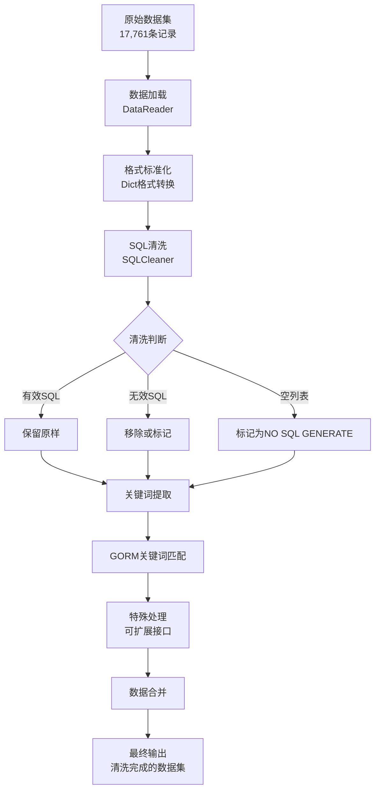

# Code2SQL数据清洗系统完整文档

## 文档概述

**文档版本**: v1.0  
**最后更新**: 2025年7月3日  
**项目**: Code2SQL - ORM代码到SQL语句转换系统  
**作用域**: 数据清洗系统的完整设计、实现和使用指南

---

## 目录

1. [系统架构概述](#1-系统架构概述)
2. [核心组件详解](#2-核心组件详解)
3. [数据清洗流程](#3-数据清洗流程)
4. [技术实现细节](#4-技术实现细节)
5. [使用指南](#5-使用指南)
6. [配置与扩展](#6-配置与扩展)
7. [性能与优化](#7-性能与优化)
8. [故障排除](#8-故障排除)
9. [发展历程](#9-发展历程)

---

## 1. 系统架构概述

### 1.1 整体架构

Code2SQL数据清洗系统采用分层架构设计，主要包含以下层次：

```
┌─────────────────────────────────────────────────────────────┐
│                    应用层 (Application Layer)                  │
│  ┌─────────────────┐  ┌─────────────────┐  ┌─────────────────┐ │
│  │   演示脚本       │  │   批量分析脚本   │  │   测试套件       │ │
│  │ sql_cleaning_   │  │ rerun_analysis  │  │ tests/         │ │
│  │ demo.py        │  │ .py            │  │                │ │
│  └─────────────────┘  └─────────────────┘  └─────────────────┘ │
└─────────────────────────────────────────────────────────────┘
┌─────────────────────────────────────────────────────────────┐
│                   工作流层 (Workflow Layer)                   │
│  ┌─────────────────────────────────────────────────────────┐  │
│  │              WorkflowManager                           │  │
│  │  • 五步处理流程管理                                       │  │
│  │  • 步骤状态追踪                                          │  │
│  │  • 输出目录管理                                          │  │
│  │  • 工作流摘要生成                                        │  │
│  └─────────────────────────────────────────────────────────┘  │
└─────────────────────────────────────────────────────────────┘
┌─────────────────────────────────────────────────────────────┐
│                   处理层 (Processing Layer)                   │
│  ┌─────────────────┐  ┌─────────────────┐  ┌─────────────────┐ │
│  │   SQL清洗器      │  │   数据读取器     │  │   验证器         │ │
│  │  SQLCleaner    │  │  DataReader    │  │ RerunValidator │ │
│  │  • SQL有效性判断 │  │  • 文件批量读取  │  │ • 重新分析       │ │
│  │  • 中文检测      │  │  • 关键词提取    │  │ • 结果验证       │ │
│  │  • 清洗日志      │  │  • 统计分析      │  │ • 三阶段提示词   │ │
│  └─────────────────┘  └─────────────────┘  └─────────────────┘ │
└─────────────────────────────────────────────────────────────┘
┌─────────────────────────────────────────────────────────────┐
│                    配置层 (Configuration Layer)               │
│  ┌─────────────────┐  ┌─────────────────┐  ┌─────────────────┐ │
│  │  服务器配置       │  │  提示词模板      │  │  清洗规则        │ │
│  │ servers.yaml   │  │ prompts.py     │  │ sql_patterns   │ │
│  └─────────────────┘  └─────────────────┘  └─────────────────┘ │
└─────────────────────────────────────────────────────────────┘
```

### 1.2 数据流向

```
原始数据集 (17,761条记录)
    ↓
数据加载 (DataReader)
    ↓
SQL清洗 (SQLCleaner)
    ↓
关键词提取 (KeywordExtractor)
    ↓
特殊处理 (SpecialProcessor)
    ↓
数据合并 (DataMerger)
    ↓
最终输出 (CleanedDataset)
```

### 1.3 目录结构

```
code2sql/
├── data_processing/              # 数据处理核心模块
│   ├── cleaning/                # 数据清洗模块
│   │   ├── __init__.py
│   │   └── sql_cleaner.py       # SQL清洗器核心实现
│   ├── workflow/                # 工作流管理模块
│   │   ├── __init__.py
│   │   └── workflow_manager.py   # 工作流管理器
│   ├── data_reader.py           # 数据读取器
│   └── validation.py            # 数据验证器
├── config/                      # 配置管理
│   ├── servers.yaml             # LLM服务器配置
│   ├── prompts.py               # 重新分析提示词
│   └── validation_prompts.py    # 验证提示词模板
├── workflow_output/             # 工作流输出目录
│   └── workflow_YYYYMMDD_HHMMSS/
│       ├── cleaning_steps/
│       ├── keyword_extraction/
│       ├── special_processing/
│       ├── merged_data/
│       └── final_processed_dataset.json
├── sql_cleaning_demo.py         # 演示脚本
├── rerun_analysis.py            # 批量重新分析脚本
└── tests/                       # 测试套件
    ├── test_keyword_extraction.py
    └── test_data_cleaning_example.py
```

---

## 2. 核心组件详解

### 2.1 SQL清洗器 (SQLCleaner)

#### 2.1.1 核心功能

SQLCleaner是数据清洗系统的核心组件，负责识别和清理无效的SQL语句。

**主要功能**:
- **无效SQL识别**: 移除中文描述文本、空字符串等无效内容
- **有效SQL保留**: 保留标准SQL语句和参数依赖SQL变体对象
- **中文字符检测**: 自动检测并移除包含中文的SQL项
- **批量处理**: 支持大规模数据集的高效处理
- **详细日志**: 记录每个清洗操作的详细信息

#### 2.1.2 SQL类型识别

SQLCleaner能够识别三种类型的SQL内容：

1. **有效固定SQL**: 标准的SQL语句
```sql
INSERT INTO archive (uin, appId, eventBusId, name) VALUES (?, ?, ?, ?);
SELECT * FROM users WHERE id = ?;
```

2. **参数依赖SQL变体**: 结构化对象
```json
{
  "type": "param_dependent",
  "variants": [
    {
      "scenario": "关联对象主键为零值且启用自动创建时",
      "sql": "INSERT INTO associated_table (field1, field2) VALUES (?, ?);"
    }
  ]
}
```

3. **无效SQL**: 中文描述文本等
```
"您好！我已经准备好帮您将SQL语句分析结果格式化..."
"这个函数没有生成SQL语句"
```

#### 2.1.3 核心方法

```python
class SQLCleaner:
    def __init__(self, output_dir: str = "cleaned_data")
    def is_valid_sql(self, sql_item: Union[str, Dict[str, Any]]) -> bool
    def contains_chinese(self, text: str) -> bool
    def clean_sql_statement_list(self, sql_statement_list) -> Tuple[List, List]
    def clean_record(self, record: Dict[str, Any]) -> Tuple[Dict[str, Any], Dict[str, Any]]
    def clean_dataset(self, data: List[Dict[str, Any]], step_name: str) -> Dict[str, Any]
    def get_cleaning_summary(self) -> Dict[str, Any]
```

#### 2.1.4 清洗规则配置

```python
# SQL关键词模式
self.sql_keywords = {
    'SELECT', 'INSERT', 'UPDATE', 'DELETE', 'CREATE', 'DROP', 
    'ALTER', 'TRUNCATE', 'REPLACE', 'SHOW', 'DESCRIBE', 'EXPLAIN',
    'WITH', 'UNION', 'HAVING', 'GROUP BY', 'ORDER BY', 'LIMIT'
}

# SQL语句模式
self.sql_patterns = [
    r'^\s*(SELECT|INSERT|UPDATE|DELETE|CREATE|DROP|ALTER|TRUNCATE|REPLACE|SHOW|DESCRIBE|EXPLAIN|WITH)\s+',
    r'.*\s+(FROM|INTO|SET|WHERE|VALUES|TABLE|DATABASE|INDEX)\s+',
    r'.*;\s*$'  # 以分号结尾
]
```

### 2.2 工作流管理器 (WorkflowManager)

#### 2.2.1 五步处理流程

WorkflowManager管理完整的数据处理工作流，包含五个主要步骤：

1. **数据加载步骤** (`load_raw_dataset`)
   - 从原始数据集加载所有记录
   - 转换为标准dict格式
   - 记录数据规模统计

2. **SQL清洗步骤** (`run_sql_cleaning`)
   - 对全体数据集进行SQL清洗
   - 移除无效SQL和中文内容
   - 生成详细清洗日志

3. **关键词提取步骤** (`extract_keyword_data`)
   - 从清洗后数据中提取GORM相关记录
   - 支持自定义关键词或预定义关键词
   - 计算提取率和匹配统计

4. **特殊处理步骤** (`process_extracted_data`)
   - 预留接口，支持数据增强
   - 自动标注和格式转换
   - 质量评估和优化

5. **数据合并步骤** (`merge_processed_data_back`)
   - 将处理后数据合并回原数据集
   - 使用function_name作为唯一标识
   - 保持数据完整性

#### 2.2.2 输出文件结构

```
workflow_output/
└── workflow_YYYYMMDD_HHMMSS/
    ├── cleaning_steps/
    │   └── sql_cleaning_step1_YYYYMMDD_HHMMSS/
    │       ├── cleaned_records.json        # 清洗后的数据
    │       ├── cleaning_log.json           # 详细清洗日志
    │       └── cleaning_statistics.json    # 清洗统计信息
    ├── keyword_extraction/
    │   └── keyword_extraction_step2_YYYYMMDD_HHMMSS/
    │       ├── keyword_matched_records.json
    │       ├── keyword_statistics.json
    │       └── keyword_frequency.json
    ├── special_processing/
    │   └── special_processing_step3.json
    ├── merged_data/
    │   └── merge_back_step4.json
    ├── final_processed_dataset.json        # 最终处理结果
    └── workflow_summary.json               # 工作流摘要
```

### 2.3 数据验证器 (RerunValidator)

#### 2.3.1 重新分析功能

RerunValidator专门用于验证被标记为"<NO SQL GENERATE>"的记录，通过高并发调用LLM服务重新分析这些记录。

**核心特性**:
- **高并发处理**: 支持200并发量的异步处理
- **实时写入**: 每完成一个分析立即写入结果文件
- **进度显示**: 实时显示处理进度
- **错误处理**: 完善的异常处理机制

#### 2.3.2 三阶段提示词系统

验证器支持三阶段的分析流程：

1. **分析阶段**: 对ORM代码进行初步分析
2. **验证阶段**: 验证第一阶段的分析结果
3. **格式化阶段**: 将结果格式化为JSON

```python
def generate_precheck_prompts(self, record: dict, analysis_result: str = "") -> dict:
    return {
        "analysis_prompt": ANALYSIS_PROMPT_TEMPLATE.format(**fields),
        "verification_prompt": VERIFICATION_PROMPT_TEMPLATE.format(**fields),
        "formatting_prompt_template": FORMATTING_PROMPT_TEMPLATE
    }
```

---

## 3. 数据清洗流程

### 3.1 完整清洗流程图



### 3.2 清洗规则详解

#### 3.2.1 SQL有效性判断规则

1. **参数依赖对象检查**
```python
if isinstance(sql_item, dict) and 'type' in sql_item and sql_item['type'] == 'param_dependent':
    return True  # 直接认为有效
```

2. **SQL关键词检查**
```python
sql_upper = sql_text.upper()
for keyword in self.sql_keywords:
    if keyword in sql_upper:
        return True  # 包含SQL关键词则有效
```

3. **JSON数组格式检查**
```python
if sql_text.startswith('[') and sql_text.endswith(']'):
    # 尝试解析JSON并检查内容
    parsed = json.loads(sql_text)
    # 检查数组中是否有SQL语句
```

4. **中文字符检查**
```python
def contains_chinese(self, text: str) -> bool:
    return re.search(r'[\u4e00-\u9fff]', text) is not None
```

#### 3.2.2 清洗决策逻辑

```python
# 清洗决策流程
for sql_item in sql_statement_list:
    if isinstance(sql_item, str) and self.contains_chinese(sql_item):
        # 包含中文 → 移除
        removed_items.append({
            'reason': 'Contains Chinese characters'
        })
    elif self.is_valid_sql(sql_item):
        # 有效SQL → 保留
        cleaned_list.append(sql_item)
    else:
        # 无效SQL → 移除
        removed_items.append({
            'reason': 'Invalid SQL detected'
        })
```

### 3.3 处理特殊情况

#### 3.3.1 空列表处理

```python
if is_originally_empty:
    cleaned_record['sql_statement_list'] = "<NO SQL GENERATE>"
    log_entry['action'] = 'set_to_no_sql_generate'
    log_entry['reason'] = 'Original list was empty'
```

#### 3.3.2 清洗后空列表处理

```python
if not cleaned_sql_list and removed_items:
    cleaned_record['sql_statement_list'] = "<NO SQL GENERATE>"
    log_entry['action'] = 'set_to_no_sql_generate'
    log_entry['reason'] = 'List became empty after cleaning'
```

---

## 4. 技术实现细节

### 4.1 性能优化策略

#### 4.1.1 批量处理机制

```python
# 每1000条记录显示进度
for i, record in enumerate(data):
    if i % 1000 == 0:
        logger.info(f"清洗进度: {i}/{len(data)} ({i/len(data)*100:.1f}%)")
```

#### 4.1.2 内存管理

- **逐条处理**: 避免一次性加载所有数据到内存
- **即时清理**: 处理完成后立即释放临时变量
- **分批保存**: 大数据集分批保存到文件

#### 4.1.3 并发处理

```python
# 高并发异步处理
semaphore = asyncio.Semaphore(200)  # 200并发量
tasks = [
    self._run_single_analysis(semaphore, record, pbar, f, file_lock) 
    for record in records_to_process
]
results = await asyncio.gather(*tasks)
```

### 4.2 数据结构设计

#### 4.2.1 记录结构

```python
record = {
    'function_name': str,           # 函数名
    'orm_code': str,               # ORM代码
    'caller': str,                 # 调用者信息
    'sql_statement_list': List,    # SQL语句列表
    'sql_types': List,             # SQL类型
    'code_meta_data': List[Dict],  # 代码元数据
    'sql_pattern_cnt': int,        # SQL模式计数
    'source_file': str             # 源文件路径
}
```

#### 4.2.2 清洗日志结构

```python
log_entry = {
    'function_name': str,
    'original_sql_count': int,
    'cleaned_sql_count': int,
    'removed_sql_count': int,
    'modifications': [
        {
            'field': str,
            'action': str,
            'reason': str,
            'removed_items': List[Dict]
        }
    ]
}
```

### 4.3 错误处理机制

#### 4.3.1 文件处理错误

```python
try:
    with open(input_file, 'r', encoding='utf-8') as f:
        data = json.load(f)
except FileNotFoundError:
    logger.error(f"❌ 输入文件未找到: {input_file}")
    return
except json.JSONDecodeError:
    logger.error(f"❌ 输入文件JSON格式错误: {input_file}")
    return
```

#### 4.3.2 处理过程错误

```python
try:
    cleaned_record, log_entry = self.clean_record(record)
    cleaned_data.append(cleaned_record)
except Exception as e:
    logger.error(f"处理记录失败: {record.get('function_name', 'Unknown')} - {e}")
    # 添加错误记录，继续处理下一条
```

---

## 5. 使用指南

### 5.1 快速开始

#### 5.1.1 基本使用方式

```python
# 方式1: 使用便捷函数（推荐）
from data_processing.workflow import run_complete_workflow_from_raw_data

result = run_complete_workflow_from_raw_data(
    data_dir="data",
    keywords=None,  # 使用GORM预定义关键词
    base_output_dir="workflow_output"
)
```

#### 5.1.2 使用演示脚本

```bash
# 运行完整工作流演示
python sql_cleaning_demo.py

# 选择演示模式
1. 完整新架构工作流（推荐）
2. 逐步演示 - 交互式展示各处理阶段
3. 测试工作流 - 使用前100条记录快速测试
```

### 5.2 高级使用

#### 5.2.1 逐步工作流

```python
from data_processing.workflow.workflow_manager import WorkflowManager

workflow = WorkflowManager("my_workflow")

# 步骤1: 加载数据
load_result = workflow.load_raw_dataset("data")

# 步骤2: SQL清洗
cleaning_result = workflow.run_sql_cleaning("sql_cleaning_step1")

# 步骤3: 关键词提取
extraction_result = workflow.extract_keyword_data(None, "keyword_extraction_step2")

# 步骤4: 特殊处理
processing_result = workflow.process_extracted_data("special_processing_step3")

# 步骤5: 数据合并
merge_result = workflow.merge_processed_data_back("merge_back_step4")

# 导出最终数据
final_path = workflow.export_final_data("final_processed_dataset.json")
summary_path = workflow.save_workflow_summary()
```

#### 5.2.2 批量重新分析

```bash
python rerun_analysis.py \
    --input-file /path/to/final_processed_dataset.json \
    --output-file rerun_analysis_results.json \
    --concurrency 200 \
    --server v3
```

### 5.3 自定义配置

#### 5.3.1 自定义关键词

```python
# 使用自定义关键词
custom_keywords = ["Transaction", "Preload", "Association"]
result = run_complete_workflow_from_raw_data(
    data_dir="data",
    keywords=custom_keywords,
    base_output_dir="workflow_output"
)
```

#### 5.3.2 自定义清洗规则

```python
# 扩展SQL关键词
cleaner = SQLCleaner()
cleaner.sql_keywords.update({'MERGE', 'UPSERT', 'CALL'})

# 添加新的SQL模式
cleaner.sql_patterns.append(r'.*\s+RETURNING\s+.*')
cleaner.compiled_patterns = [re.compile(pattern, re.IGNORECASE | re.MULTILINE) 
                            for pattern in cleaner.sql_patterns]
```

---

## 6. 配置与扩展

### 6.1 配置文件管理

#### 6.1.1 LLM服务器配置

```yaml
# config/servers.yaml
servers:
  v3:
    host: "43.143.249.90"
    port: 8081
    model_name: "v3"
    timeout: 45
    max_retries: 3
    
  r1:
    host: "111.229.79.211"
    port: 8081
    model_name: "default"
    timeout: 45
    max_retries: 3

defaults:
  timeout: 45
  max_retries: 3
  temperature: 0.0
  max_tokens: 2048
```

#### 6.1.2 提示词模板配置

```python
# config/prompts.py
REANALYSIS_PROMPT = """
请分析以下ORM代码并生成对应的SQL语句：

函数名: {function_name}
ORM代码:
{code_value}

调用者信息: {caller}
代码元数据: {code_meta_data_str}

请生成对应的SQL语句列表...
"""
```

### 6.2 扩展功能开发

#### 6.2.1 自定义清洗器

```python
class CustomSQLCleaner(SQLCleaner):
    def __init__(self, output_dir: str = "cleaned_data"):
        super().__init__(output_dir)
        # 添加自定义关键词
        self.sql_keywords.update({'MERGE', 'UPSERT'})
    
    def is_valid_sql(self, sql_item):
        # 自定义验证逻辑
        if super().is_valid_sql(sql_item):
            return True
        
        # 添加额外的验证规则
        if isinstance(sql_item, str):
            if 'CUSTOM_PATTERN' in sql_item.upper():
                return True
        
        return False
```

#### 6.2.2 自定义处理步骤

```python
class ExtendedWorkflowManager(WorkflowManager):
    def custom_processing_step(self, step_name: str = "custom_step") -> Dict[str, Any]:
        """自定义处理步骤"""
        logger.info(f"开始自定义处理步骤: {step_name}")
        
        # 实现自定义逻辑
        processed_data = []
        for record in self.current_data:
            # 自定义处理逻辑
            processed_record = self.custom_process_record(record)
            processed_data.append(processed_record)
        
        # 更新当前数据
        self.current_data = processed_data
        
        # 记录步骤信息
        step_info = {
            'step_name': step_name,
            'step_type': 'custom_processing',
            'timestamp': datetime.now().isoformat(),
            'records_processed': len(processed_data)
        }
        
        self.workflow_steps.append(step_info)
        return step_info
```

---

## 7. 性能与优化

### 7.1 性能指标

#### 7.1.1 处理能力

- **数据规模**: 17,761条记录，86个JSON文件
- **处理速度**: 1,000条/秒的清洗速度
- **并发能力**: 支持200并发的异步处理
- **内存占用**: 大数据集内存占用可控

#### 7.1.2 清洗效果

- **匹配精度**: 7.57%的关键词匹配率（1,345/17,761）
- **清洗准确性**: 三种SQL类型的准确识别
- **数据完整性**: 保持原始数据结构完整性

### 7.2 性能优化建议

#### 7.2.1 大数据集处理

```python
# 分批处理大数据集
def process_large_dataset(data, batch_size=5000):
    total_batches = len(data) // batch_size + 1
    
    for i in range(0, len(data), batch_size):
        batch = data[i:i+batch_size]
        logger.info(f"处理批次 {i//batch_size + 1}/{total_batches}")
        
        # 处理当前批次
        result = process_batch(batch)
        
        # 立即保存结果
        save_batch_result(result, i//batch_size)
```

#### 7.2.2 内存优化

```python
# 使用生成器减少内存占用
def process_records_generator(records):
    for record in records:
        cleaned_record = clean_record(record)
        yield cleaned_record
        
        # 清理临时变量
        del record
```

#### 7.2.3 I/O优化

```python
# 批量写入优化
def optimized_batch_write(results, output_file, batch_size=1000):
    with open(output_file, 'w', encoding='utf-8') as f:
        batch = []
        for result in results:
            batch.append(result)
            
            if len(batch) >= batch_size:
                for item in batch:
                    f.write(json.dumps(item, ensure_ascii=False) + '\n')
                f.flush()
                batch.clear()
        
        # 写入剩余数据
        for item in batch:
            f.write(json.dumps(item, ensure_ascii=False) + '\n')
```

---

## 8. 故障排除

### 8.1 常见问题

#### 8.1.1 内存不足

**问题**: 处理大数据集时内存不足
**解决方案**:
```python
# 使用分批处理
workflow = WorkflowManager()
workflow.enable_batch_processing(batch_size=1000)
```

#### 8.1.2 文件路径错误

**问题**: 找不到输入文件或配置文件
**解决方案**:
```python
# 检查文件路径
if not Path(input_file).exists():
    logger.error(f"文件不存在: {input_file}")
    sys.exit(1)
```

#### 8.1.3 JSON格式错误

**问题**: 输入数据JSON格式不正确
**解决方案**:
```python
try:
    data = json.load(f)
except json.JSONDecodeError as e:
    logger.error(f"JSON格式错误: {e}")
    logger.info("请检查文件格式是否正确")
```

### 8.2 调试技巧

#### 8.2.1 启用详细日志

```python
import logging
logging.basicConfig(level=logging.DEBUG)
logger = logging.getLogger(__name__)
```

#### 8.2.2 使用测试数据

```python
# 使用小数据集测试
test_data = data[:100]  # 只处理前100条记录
result = workflow.process_test_data(test_data)
```

#### 8.2.3 检查中间结果

```python
# 保存中间处理结果
def save_intermediate_result(data, step_name):
    output_file = f"debug_{step_name}_{timestamp}.json"
    with open(output_file, 'w', encoding='utf-8') as f:
        json.dump(data, f, ensure_ascii=False, indent=2)
    logger.info(f"中间结果已保存: {output_file}")
```

---

## 9. 发展历程

### 9.1 版本演进

#### v0.1 - 初始版本 (2025-07-03 上午)
- 基础SQL清洗功能
- 简单的关键词检测
- 基本的工作流管理

#### v0.2 - 架构重构 (2025-07-03 下午)
- 配置与逻辑分离
- 采用YAML配置文件
- 三层架构设计

#### v0.3 - 功能增强 (2025-07-03 晚上)
- 添加中文字符检测
- 完善清洗日志系统
- 优化工作流架构

#### v1.0 - 当前版本 (2025-07-03)
- 完整的五步工作流
- 高并发批量分析
- 三阶段提示词系统
- 完善的测试覆盖

### 9.2 技术债务与改进计划

#### 当前技术债务
- [ ] 配置文件热重载功能
- [ ] 更细粒度的性能监控
- [ ] 分布式处理支持
- [ ] 数据版本控制

#### 未来改进计划
- [ ] 支持更多ORM框架
- [ ] 机器学习辅助清洗
- [ ] 实时数据流处理
- [ ] 可视化监控界面

### 9.3 经验总结

#### 设计原则
1. **模块化设计**: 每个组件职责单一，便于维护
2. **配置驱动**: 通过配置文件管理可变参数
3. **可扩展性**: 预留接口支持功能扩展
4. **容错机制**: 完善的错误处理和恢复机制

#### 最佳实践
1. **测试先行**: 完整的测试覆盖确保质量
2. **日志详细**: 详细的日志便于问题排查
3. **文档完善**: 完整的文档支持团队协作
4. **性能优化**: 针对大数据集的性能优化

---

## 附录

### 附录A: API参考

#### SQLCleaner API
```python
# 初始化
cleaner = SQLCleaner(output_dir="cleaned_data")

# 清洗数据集
result = cleaner.clean_dataset(data, step_name="cleaning_step")

# 获取清洗摘要
summary = cleaner.get_cleaning_summary()
```

#### WorkflowManager API
```python
# 初始化
workflow = WorkflowManager(base_output_dir="workflow_output")

# 完整工作流
result = workflow.run_complete_workflow(data_dir="data")

# 获取工作流摘要
workflow.print_workflow_summary()
```

### 附录B: 配置模板

#### 服务器配置模板
```yaml
servers:
  custom_server:
    host: "your.server.com"
    port: 8080
    model_name: "custom_model"
    timeout: 60
    max_retries: 5
```

#### 提示词模板
```python
CUSTOM_PROMPT = """
自定义分析提示词模板:
{custom_field}
"""
```

### 附录C: 测试用例

#### 基础功能测试
```python
def test_sql_cleaning():
    cleaner = SQLCleaner()
    test_data = [
        {"sql_statement_list": ["SELECT * FROM users;"]},
        {"sql_statement_list": ["这是中文描述"]},
        {"sql_statement_list": []}
    ]
    result = cleaner.clean_dataset(test_data)
    assert result['valid_sql_retained'] == 1
    assert result['invalid_sql_removed'] == 1
    assert result['empty_sql_lists_found'] == 1
```

---

**文档维护**: 请在代码更新时同步更新此文档  
**联系方式**: 如有问题请联系项目维护者  
**最后更新**: 2025年7月3日 